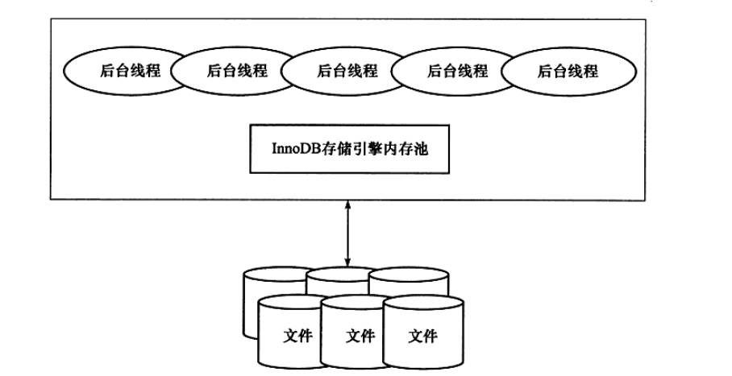

## Innodb

Innodb存储引擎有多个内存块，可以认为这些内存块组成了一个大的内存池，负责如下工作：

1. 维护所有线程/进程需要访问的多个内部数据结构
2. 缓存磁盘上的数据，方便快速的读取，同时在对磁盘文件的数据修改之前在这里缓存
3. redo log缓冲

后台线程的主要作用是负责刷新内存池中的数据，保证缓冲池中的内存缓存的是最近的数据。此外将已修改的数据文件刷新到磁盘文件，同时保证在数据库发生异常的情况下InnoDB能恢复到正常运行状态。

## 后台线程

Innodb存储引擎是多线程的模型，后台有多个不同的后台线程，负载不同的任务

1. master thread Master Thread是一个非常核心的后台线程，主要负责将缓冲池中的数据异步刷新到磁盘，保证数据的一致性，包括脏页的刷新、合并插入缓冲(INSERT BUFFER)、UNDO页的回收等。
2. IO thread
3. purge thread 事务被提交后，其所使用的undolog可能不再需要，因此需要PurgeThread来回收已经使用并分配的undo页。在InnoDB 1.1版本之前，purge操作仅在InnoDB存储引擎的Master Thread中完成。而从InnoDB 1.1版本开始，purge操作可以独立到单独的线程中进行，以此来减轻Master Thread的工作，从而提高CPU的使用率以及提升存储引擎的性能。用户可以在MySQL数据库的配置文件中添加如下命令来启用独立的PurgeThread:
4. Page Cleaner Thread是在InnoDB 1.2.x
5. 版本中引人的。其作用是将之前版本中脏页的刷新操作都放入到单独的线程中来完成。而其目的是为了减轻原Master Thread的工作及对于用户查询线程的阻塞，进一步提高InnoDB存储引擎的性能。

## 缓冲池

InnoDB存储引擎是基于磁盘存储的，并将其中的记录按照页的方式进行管理。因此可将其视为基于磁盘的数据库系统(Disk-base Database)。在数据库系统中，由于CPU速度与磁盘速度之间的鸿沟，基于磁盘的数据库系统通常使用缓冲池技术来提高数据库的整体性能。

缓冲池简单来说就是一块内存区域，通过内存的速度来弥补磁盘速度较慢对数据库性能的影响。在数据库中进行读取页的操作，首先将从磁盘读到的页存放在缓冲池中，这个过程称为将页“FIX”在缓冲池中。下一次再读相同的页时，首先判断该页是否在缓冲池中。若在缓冲池中，称该页在缓冲池中被命中，直接读取该页。否则，读取磁盘上的页。

对于数据库中页的修改操作，则首先修改在缓冲池中的页，然后再以一定的频率刷新到磁盘上。这里需要注意的是，页从缓冲池刷新回磁盘的操作并不是在每次页发生更新时触发，而是通过一种称为Checkpoint的机制刷新回磁盘。同样，这也是为了提高数据库的整体性能。

综上所述，缓冲池的大小直接影响着数据库的整体性能。由于32位操作系统的限制，在该系统下最多将该值设置为3G。此外用户可以打开操作系统的PAE选项来获得32位操作系统下最大64GB内存的支持。随着内存技术的不断成熟，其成本也在不断下降。单条8GB的内存变得非常普遍，而PC服务器已经能支持512GB的内存。因此为了让数据库使用更多的内存，强烈建议数据库服务器都采用64位的操作系统。

具体来看，缓冲池中缓存的数据页类型有：索引页、数据页、undo页、插入缓冲(insert buffer)、自适应哈希索引(adaptive hash index)、InnoDB存储的锁信息(lockinfo)、数据字典信息(data dictionary)等。不能简单地认为，缓冲池只是缓存索引页和数据页，它们只是占缓冲池很大的一部分而已。下图很好地显示了InnoDB存储引擎中内存的结构情况。

从InnoDB 1.0.x版本开始，允许有多个缓冲池实例。每个页根据哈希值平均分配到不同缓冲池实例中。这样做的好处是减少数据库内部的资源竞争，增加数据库的并发处理能力，可以通过参数innodb_buffer _pool_instances来进行配置，该值默认为1.

## 重做日志缓冲

从图2-2可以看到，InnoDB存储引擎的内存区域除了有缓冲池外，还有重做日志缓冲(redo log buffer)。InnoDB存储引擎首先将重做日志信息先放入到这个缓冲区，然后按一定频率将其刷新到重做日志文件。重做日志缓冲一般不需要设置得很大，因为一般情况下每一秒钟会将重做日志缓冲刷新到日志文件，因此用户只需要保证每秒产生的事务量在这个缓冲大小之内即可。该值可由配置参数innodb_log_buffer_size控制，默认为8MB:

在通常情况下，8MB的重做日志缓冲池足以满足绝大部分的应用，因为重做日志在下列三种情况下会将重做日志缓冲中的内容刷新到外部磁盘的重做日志文件中。
- Master Thread每一秒将重做日志缓冲刷新到重做日志文件；
- 每个事务提交时会将重做日志缓冲刷新到重做日志文件；
- 当重做日志缓冲池剩余空间小于1/2时，重做日志缓冲刷新到重做日志文件。
## 额外的内存池

额外的内存池通常被DBA忽略，他们认为该值并不十分重要，事实恰恰相反，该值同样十分重要。在InnoDB存储引擎中，对内存的管理是通过一种称为内存堆(heap)的方式进行的。在对一些数据结构本身的内存进行分配时，需要从额外的内存池中进行申请，当该区域的内存不够时，会从缓冲池中进行申请。例如，分配了缓冲池(innodb_buffer_pool),但是每个缓冲池中的帧缓冲(frame buffer)还有对应的缓冲控制对象(buffer control block),这些对象记录了一些诸如LRU、锁、等待等信息，而这个对象的内存需要从额外内存池中申请。因此，在申请了很大的InnoDB缓冲池时，也应考虑相应的增加这个值

## CheckPoint技术

