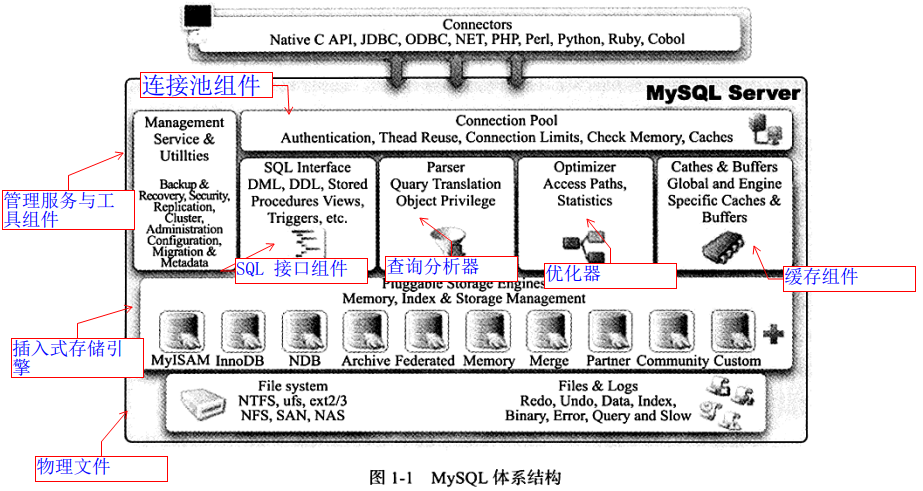

## MySQL 体系架构和存储引擎

1. MySQL 被设计成一个单进程多线程架构的数据库，MySQL 数据库实例在系统上的表现就是一个进程。

### 数据库和实例的区别

从概念上来说，数据库是文件的集合，是依照某种数据模型组织起来并存放于二级存储器中的数据集合；数据库实例是程序，是位于用户与操作系统之间的一层数据管理软件，用户对数据库数据的任何操作，包括数据库定义、数据查询、数据维护、数据库运行控制等都是在数据库实例下进行的，应用程序只有通过数据库实例才能和数据库打交道。

如果这样讲解后读者还是不明白，那这里再换一种更为直白的方式来解释：数据库是由一个个文件组成(一般来说都是二进制的文件)的，要对这些文件执行诸如SELECT、INSERT、UPDATE和DELETE之类的数据库操作是不能通过简单的操作文件来更改数据库的内容，需要通过数据库实例来完成对数据库的操作。

### 总体的架构图

从图可以发现，MySQL由以下几部分组成：
- 连接池组件
- 管理服务和工具组件
- SQL接口组件
- 查询分析器组件
- 优化器组件
- 缓冲(Cache)组件
- 插件式存储引擎
- 物理文件

从图还可以发现，MySQL数据库区别于其他数据库的最重要的一个特点就是其插件式的表存储引擎。MySQL插件式的存储引擎架构提供了一系列标准的管理和服务支持，这些标准与存储引擎本身无关，可能是每个数据库系统本身都必需的，如SQL分析器和优化器等，而存储引擎是底层物理结构的实现，每个存储引擎开发者可以按照自己的意愿来进行开发。

***MySQL 的体系架构，需要特别注意的是，存储引擎是基于表的，而不是数据库。***

## Mysql存储引擎

